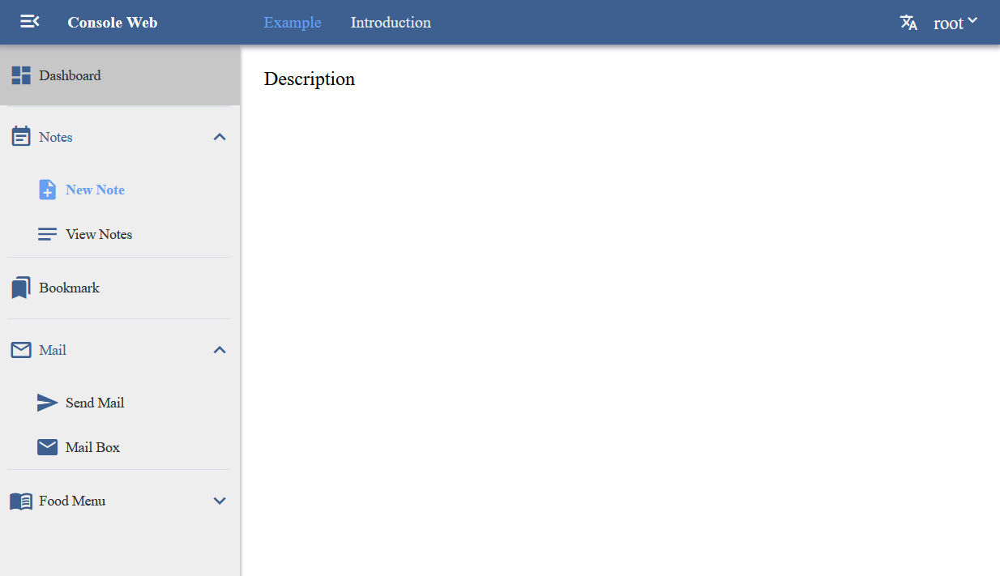

# Console Web Framework

[English](./README.md)

基于 [Vue](https://github.com/vuejs/vue) 开发

## 使用介绍

1. Git克隆此代码库 `git clone https://github.com/bnyu/console_web.git`
2. 安装 [Yarn](https://yarnpkg.com/getting-started/install) 或者直接使用 [Npm](https://www.npmjs.com/)
3. 在你克隆的文件夹目录下运行 `yarn install` 或 `npm install` 安装依赖
4. 在此框架下编写你自己的代码, 同时使用 `yarn run serve` 或 `npm run serve` 查看效果
5. 将你的应用打包 `yarn run build` or `npm run build`

### 示例

在mock文件夹下伪造了一些有着不同权限的用户. 你可以尝试登录他们, 查看效果.

| 用户名       |  密码        |
| ----------- | ----------- |
| root        | 123456      |
| p1          | 123456      |
| p2          | 123456      |
| p3          | 123456      |
| p4          | 123456      |

正式环境你需要服务器来处理用户登录以及其他响应, 不过你可以通过mock来帮助开发.

## 证书

使用 [Apache License 2.0](LICENSE) 证书.
